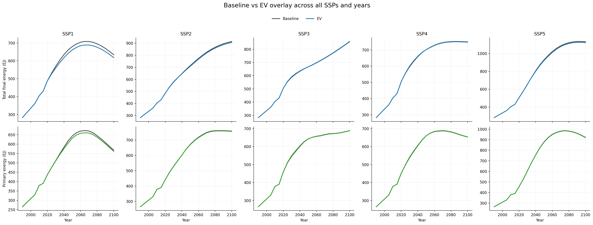
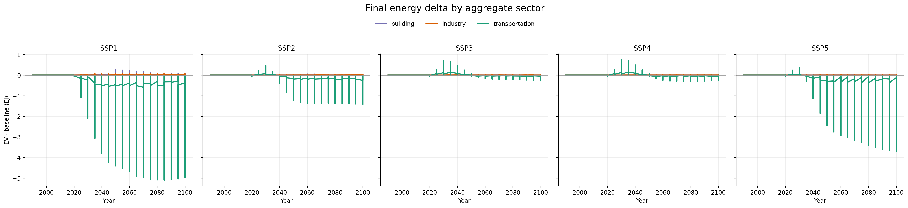
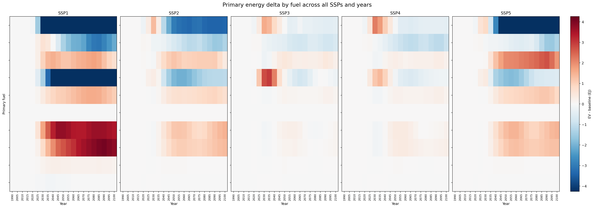
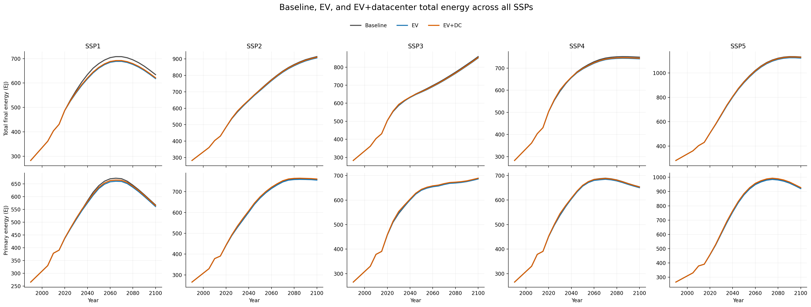
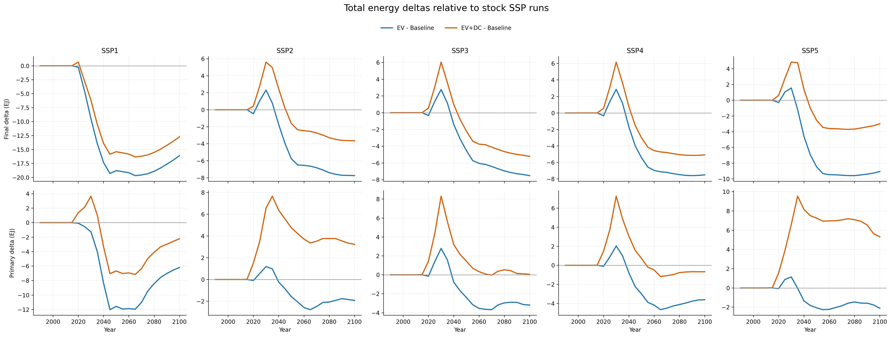
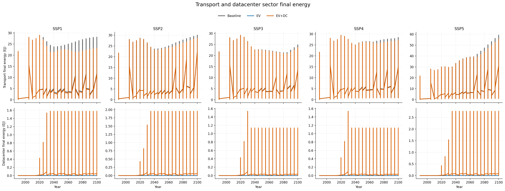
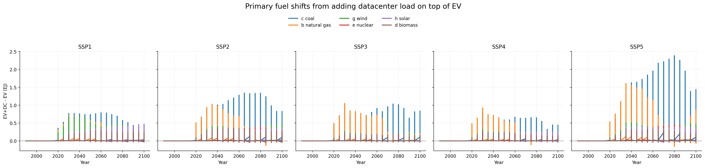

# GCAM EV and Data Center Sector Overlays

This repository is for `EV` and `data center sector` overlays for `GCAM v7.0` without modifying GCAM C++ source code. The implemented modules are:

- a transport electrification overlay so that `SSP1` to `SSP5` can represent a more explicit light-duty vehicle transition with separate `BEV`, `PHEV`, `FCEV`, `Hybrid Liquids`, `Liquids`, and `NG` pathways
- an explicit `comm datacenter sector` overlay implemented as an independent `energy-final-demand` sector with a matching electricity supplysector, so data-center electricity demand is added transparently while primary energy is still solved endogenously by GCAM

The design goal is to keep both modules consistent with GCAM's demand structure and energy accounting while making additional sector assumptions transparent and reproducible. The data center module is implemented as an incremental final-energy sector above stock demand rather than as a direct override to primary energy.

The repository is also structured so the two modules can be run separately or together. The evidence and design note for the data center module are in [docs/datacenter_sector_plan.md](docs/datacenter_sector_plan.md).

## What The Current Modules Change

- Adds `transportation_EV_SSP1.xml` to `transportation_EV_SSP5.xml` overlays for the GCAM `trn_pass_road_LDV_4W` sector.
- Keeps `BEV`, `FCEV`, `Hybrid Liquids`, `Liquids`, and `NG` as distinct transport technologies.
- Adds a new `PHEV` technology as a true dual-fuel GCAM technology with:
  - `elect_td_trn`
  - `refined liquids enduse`
- Applies SSP-specific transport technology share-weights derived from direct IEA EV sales-share anchors.
- Keeps inherited `BEV` and `FCEV` GCAM cost and energy coefficients unchanged, so the EV overlay is driven primarily by the documented IEA-to-share-weight translation.
- Uses a constant `PHEV` electric utility factor of `0.55` to minimize scenario-specific author discretion.
- Generates:
  - `generated/exe/batch_SSP_EV.xml`
  - `generated/exe/configuration_ssp_ev.xml`
  - `generated/exe/run-gcam-ssp-ev.command`
  - `generated/output/queries/EV_SSP_queries.xml`
- Adds `datacenter_sector_SSP1.xml` to `datacenter_sector_SSP5.xml` overlays for a new regional `energy-final-demand` sector named `comm datacenter sector`.
- Couples that final-demand sector to an electricity-only `supplysector` and `global-technology-database` entry, both named `comm datacenter sector`.
- Keeps the data center module electricity-only through `elect_td_bld`.
- Treats the explicit data center sector as incremental load above a near-zero historical floor, so the overlay does not back-cast the full historical digital load into GCAM's calibration years.
- Generates:
  - `generated/exe/batch_SSP_DC.xml`
  - `generated/exe/configuration_ssp_dc.xml`
  - `generated/exe/run-gcam-ssp-dc.command`
  - `generated/exe/batch_SSP_EV_DC.xml`
  - `generated/exe/configuration_ssp_ev_dc.xml`
  - `generated/exe/run-gcam-ssp-ev-dc.command`
  - `generated/output/queries/DC_SSP_queries.xml`

## Modeling Logic

### 1. GCAM-consistent transport implementation

This add-on follows GCAM's native transport technology structure. It does not create a new top-level electricity demand sector. Instead, EVs remain transport technologies inside the existing LDV subsectors, which means:

- final energy remains transport final energy by carrier and technology
- primary energy remains an emergent system outcome from electricity, refining, hydrogen, and upstream supply modules

That is the correct GCAM accounting logic. In practice:

- `BEV` final energy is observed in transport queries through `elect_td_trn`
- `PHEV` final energy is split across `elect_td_trn` and `refined liquids enduse`
- primary energy impacts are read from GCAM's existing primary energy queries, not hand-coded into transport XML

### 2. GCAM-consistent data center implementation

The data center module no longer uses a commercial-building service overlay. It is implemented as a dedicated regional `energy-final-demand` sector named `comm datacenter sector`, paired with a same-named electricity `supplysector` and a matching `global-technology-database` entry.

The explicit data center load is handled as an incremental overlay:

- historical calibration periods remain essentially zero, with only a tiny `2015` seed to preserve a solvable path
- future demand is driven through `income-elasticity` schedules that are back-calculated from SSP GDP paths and the target electricity-demand trajectories
- all explicit demand enters as `elect_td_bld`, so the sector remains electricity-only while upstream primary energy is still endogenously determined by GCAM

This means:

- final energy from the new module appears directly in `total final energy by sector` under `comm datacenter sector`
- economy-wide final energy still appears in `total final energy by aggregate sector`
- primary energy response still appears in `primary energy consumption by region (direct equivalent)`

### 3. SSP mapping logic

The EV overlay now uses one IEA edition only:

- `IEA (2024), Global EV Outlook 2024`

The archived public source package is:

- [iea_global_ev_outlook_2024_public_extract.json](/Users/sekiyamitsuna/CodexCLI/GCAM/gcam-ev-datacenter-overlays/data/source_exports/iea_global_ev_outlook_2024_public_extract.json)

The scenario mapping is:

- `SSP1 -> GEVO 2024 NZE`
- `SSP2 -> GEVO 2024 STEPS`
- `SSP3 -> GEVO 2024 STEPS`
- `SSP4 -> GEVO 2024 STEPS`
- `SSP5 -> GEVO 2024 APS`

The EV anchors are built from public GEVO-2024 statements:

- historical public anchors:
  - `2018 = 2%`
  - `2023 = 18%`
- scenario public anchors:
  - `STEPS 2030 = 40%`
  - `STEPS 2035 = 55%`
  - `APS 2030 = 43.72093023255814%`
  - `APS 2035 = 66.66666666666667%`
  - `NZE 2030 = 65%`
  - `NZE 2035 = 100%`

The calculated anchors are:

```text
share_2020
= 2.0 * (18.0 / 2.0)^((2020 - 2018) / (2023 - 2018))
= 4.816449370561385%

share_2025(s)
= 18.0 + (share_2030(s) - 18.0) * ((2025 - 2023) / (2030 - 2023))
```

`APS 2030` is not hand-picked. It is calculated from the same GEVO-2024 public page:

```text
APS_share_2030
= 47.0 / (43.0 / 0.40)
= 43.72093023255814%
```

GCAM does not accept market shares directly, so the direct IEA shares are translated into GCAM share-weights with an explicit relative-odds rule:

```text
target_plugin_share(tech, t) = target_total_ev_share(t) * plugin_mix(tech, t)
share_weight_plugin(tech, t) =
  N_ref * target_plugin_share(tech, t) /
  max(1 - clipped_total_ev_share(t), residual_floor)
```

where:

- `N_ref = 3` for `Hybrid Liquids`, `Liquids`, and `NG`
- each non-plugin technology keeps unit `share-weight = 1`
- `clipped_total_ev_share = min(target_total_ev_share, 0.99)`
- `residual_floor = 0.01`

Current interpretation:

- `SSP1`: `NZE`
- `SSP2`: `STEPS`
- `SSP3`: `STEPS`
- `SSP4`: `STEPS`
- `SSP5`: `APS`

This means the top-level EV adoption path is now fully anchored to one archived IEA edition. `SSP3` and `SSP4` do not currently have separate EV anchor paths because the chosen single edition does not provide a distinct public global weak-policy EV pathway that can be archived alongside `STEPS / APS / NZE`.

The rest of the SSP structure is intentionally left on the official GCAM pathway. `batch_SSP_EV.xml` is generated from the stock `batch_SSP_REF.xml`, and the only added SSP-specific input is the EV transport overlay:

- `SSP1`: `transportation_EV_SSP1.xml`
- `SSP2`: `transportation_EV_SSP2.xml`
- `SSP3`: `transportation_EV_SSP3.xml`
- `SSP4`: `transportation_EV_SSP4.xml`
- `SSP5`: `transportation_EV_SSP5.xml`

All other scenario-specific inputs continue to come from GCAM's official SSP batch file, including socioeconomic assumptions, buildings, AGLU, resource extraction, and non-CO2 controls.

For data centers, the mapping logic is different because the evidence is electricity demand rather than technology shares:

- `SSP1`: `Energy and AI High Efficiency`
- `SSP2`: `Energy and AI Base Case`
- `SSP3`: `Energy and AI Headwinds`
- `SSP4`: `Energy and AI Headwinds`
- `SSP5`: `Energy and AI Lift-Off`

The archived public source package is:

- [iea_energy_and_ai_2025_public_extract.json](/Users/sekiyamitsuna/CodexCLI/GCAM/gcam-ev-datacenter-overlays/data/source_exports/iea_energy_and_ai_2025_public_extract.json)

The global datacenter anchors are now:

- direct public values:
  - `2024 = 415 TWh`
  - `2030 = 945 TWh`
  - `2035 = 970 / 1200 / 700 / 1700 TWh` depending on the mapped case
- calculated bridge values:

```text
2020 = 415 / (1.12^4) = 263.7400025380049 TWh
2025 = 415 + (945 - 415) * (1 / 6) = 503.3333333333333 TWh
```

Regionalization starts from the public 2024 shares `USA 45%`, `China 25%`, `Europe 15%`, `Rest 15%`. The public `USA +240 TWh by 2030` statement is applied directly, and the remaining 2030 total is split across non-USA groups in proportion to the 2024 public shares. After 2035, the case level is held constant through 2100.

### 4. PHEV logic

`PHEV` is implemented as a genuine two-input GCAM technology. Its calibration blends:

- non-energy costs from `BEV` and `Hybrid Liquids`
- electric energy use from `BEV`
- liquid fuel use from `Hybrid Liquids`

The `utility_factor` controls how much of the `PHEV` service demand is served by electricity versus liquids. To avoid inventing separate SSP-specific `PHEV` behaviour, the current implementation holds:

- `utility_factor = 0.55` for all SSPs
- `cost blend = 40% BEV + 60% Hybrid Liquids`
- `capital blend = 40% BEV + 60% Hybrid Liquids`

The EV powertrain split itself is driven by direct IEA sales data where available:

- `BEV = 70%`
- `PHEV = 30%`
- `FCEV = 0%`

This is not a direct IEA sales table. It is a documented proxy built from the public GEVO-2024 statement that battery electric cars accounted for `70%` of the electric-car stock in `2023`. For `NZE`, `PHEV` goes to zero by `2035` because the same IEA edition states that light-vehicle sales are zero-emission by then.

### 5. Final and primary energy accounting

To inspect energy accounting after a run, use the included query subset:

- `transport final energy by tech and fuel`
- `transport service output by tech`
- `LDV energy by primary fuel`
- `building final energy by service and fuel`
- `building service output by service`
- `total final energy by aggregate sector`
- `primary energy consumption by region (direct equivalent)`
- `primary energy consumption by region (avg fossil efficiency)`

This combination is intentional:

- the first three queries show the transport-side EV technology transition and carrier split
- the latter two queries show whether electrification is flowing through to economy-wide final and primary energy accounting

## Parameter Provenance

This repository now archives two machine-readable IEA public extract files and derives all additional anchor points from those files with explicit formulas:

- EV source package:
  - [iea_global_ev_outlook_2024_public_extract.json](/Users/sekiyamitsuna/CodexCLI/GCAM/gcam-ev-datacenter-overlays/data/source_exports/iea_global_ev_outlook_2024_public_extract.json)
- Datacenter source package:
  - [iea_energy_and_ai_2025_public_extract.json](/Users/sekiyamitsuna/CodexCLI/GCAM/gcam-ev-datacenter-overlays/data/source_exports/iea_energy_and_ai_2025_public_extract.json)

The academically accurate wording is:

- `EV`: `IEA-anchored with explicit GCAM translation`
- `Datacenter`: `IEA-anchored with explicit bridge, regionalization, and flat post-2035 extension formulas`

The stronger claim

```text
all EV and datacenter numbers are direct IEA values
```

would still be false. The correct claim is:

```text
the repository archives public IEA source extracts and derives all additional anchor points with explicit formulas that are documented in-repo
```

### Public direct anchors now archived in-repo

`EV`

- `2018 = 2%`
- `2023 = 18%`
- `2023 BEV share of electric-car stock = 70%`
- `STEPS 2030 = 40%`
- `STEPS 2035 = 55%`
- `APS 2035 = 66.66666666666667%`
- `NZE 2030 = 65%`
- `NZE 2035 = 100%`

`Datacenter`

- `2024 = 415 TWh`
- `2024 regional shares = 45 / 25 / 15`
- `historical growth note = 12% per year`
- `2030 = 945 TWh`
- `2035 = 970 / 1200 / 700 / 1700 TWh`
- `USA increment to 2030 = 240 TWh`

### Explicit calculations now used in the code

`EV`

```text
share_2020
= 2.0 * (18.0 / 2.0)^((2020 - 2018) / (2023 - 2018))
= 4.816449370561385%

share_2025(s)
= 18.0 + (share_2030(s) - 18.0) * ((2025 - 2023) / (2030 - 2023))

APS_share_2030
= 47.0 / (43.0 / 0.40)
= 43.72093023255814%
```

`Datacenter`

```text
global_2020
= 415 / (1.12^4)
= 263.7400025380049 TWh

global_2025
= 415 + (945 - 415) * (1 / 6)
= 503.3333333333333 TWh
```

For datacenter regionalization:

```text
USA_2030 = 415 * 0.45 + 240 = 426.75 TWh
remaining_2030 = 945 - 426.75 = 518.25 TWh
```

and the non-USA `2030` total is split across `China / Europe / Rest of world` in proportion to their archived `2024` public shares. `2035` then scales the `2030` regional composition to the mapped public `2035` case endpoint, and `2040-2100` is held flat.

### Remaining modeling choices

`EV`

- using the archived public `2023 BEV stock share = 70%` as a proxy for the within-EV `BEV/PHEV/FCEV` mix
- `PHEV utility_factor = 0.55`
- `PHEV` `40/60` blending weights
- the GCAM `share-weight` conversion

`Datacenter`

- the tiny `2015` seed used to preserve GCAM calibration stability
- the within-group split using GCAM `2015` commercial electricity
- the income-elasticity inversion

The full derivation note is in [parameter_provenance.md](/Users/sekiyamitsuna/CodexCLI/GCAM/gcam-ev-datacenter-overlays/docs/parameter_provenance.md).

## Source Basis

### Primary institutional sources

- `IEA (2024), Global EV Outlook 2024`
  - used as the single archived EV source edition for public historical and scenario anchors
- `IEA (2025), Energy and AI`
  - used as the single archived datacenter source edition for public historical and scenario anchors
- `GCAM v7.0 documentation`
  - used for model execution, query structure, XML overlay behavior, transport accounting, and building-service accounting

### Supporting academic sources

- `Kyle and Kim (2011)`
  - used as the closest GCAM-specific precedent for linking light-duty vehicle technology pathways to global greenhouse gas emissions and primary energy demand
- `Mishra et al. (2013), Transportation Module of GCAM`
  - used for transport module structure and technology logic
- `Masanet et al. (2020), Recalibrating global data center energy-use estimates`
  - used to avoid naive extrapolation of global data center electricity demand in historical years
- `Shehabi et al. (2024), 2024 United States Data Center Energy Usage Report`
  - used for AI-era data center load-growth context and infrastructure interpretation
- `Zhang et al. (2023)`
  - used for technology and efficiency context around low-carbon data center operation
- `O'Neill et al. (2017)` and `Riahi et al. (2017)`
  - used for SSP narrative interpretation

## Installation

### Requirements

- a working `GCAM v7.0` package
- Python 3

### 1. Generate the overlay files

```bash
python3 scripts/generate_ev_addon.py --gcam-root /path/to/gcam-v7.0-Mac_arm64-Release-Package
python3 scripts/generate_datacenter_addon.py --gcam-root /path/to/gcam-v7.0-Mac_arm64-Release-Package
```

If `--gcam-root` is omitted, the script defaults to a sibling directory named `gcam-v7.0-Mac_arm64-Release-Package`.

### 2. Install the generated files into the GCAM package

```bash
python3 scripts/install_addon.py --gcam-root /path/to/gcam-v7.0-Mac_arm64-Release-Package
```

### 3. Run GCAM with the desired batch configuration

```bash
cd /path/to/gcam-v7.0-Mac_arm64-Release-Package/exe
./gcam -C configuration_ssp_ev.xml
```

or use the generated launcher:

```bash
cd /path/to/gcam-v7.0-Mac_arm64-Release-Package/exe
./run-gcam-ssp-ev.command
```

The EV run writes its XML database to:

```text
../output/database_basexdb_ev_ssp
```

The data center-only run is:

```bash
cd /path/to/gcam-v7.0-Mac_arm64-Release-Package/exe
./run-gcam-ssp-dc.command
```

and writes to:

```text
../output/database_basexdb_dc_ssp
```

The combined EV + data center run is:

```bash
cd /path/to/gcam-v7.0-Mac_arm64-Release-Package/exe
./run-gcam-ssp-ev-dc.command
```

and writes to:

```text
../output/database_basexdb_ev_dc_ssp
```

## Repository Layout

```text
data/ev_ssp_assumptions.json
data/datacenter_ssp_assumptions.json
scripts/generate_ev_addon.py
scripts/generate_datacenter_addon.py
scripts/install_addon.py
generated/exe/configuration_ssp_ev.xml
generated/exe/configuration_ssp_dc.xml
generated/exe/configuration_ssp_ev_dc.xml
generated/exe/batch_SSP_EV.xml
generated/exe/batch_SSP_DC.xml
generated/exe/batch_SSP_EV_DC.xml
generated/exe/run-gcam-ssp-ev.command
generated/exe/run-gcam-ssp-dc.command
generated/exe/run-gcam-ssp-ev-dc.command
generated/exe/run-validate-ssp-three-way.command
generated/input/gcamdata/xml/transportation_EV_SSP*.xml
generated/input/gcamdata/xml/datacenter_sector_SSP*.xml
generated/output/queries/EV_SSP_queries.xml
generated/output/queries/DC_SSP_queries.xml
generated/output/queries/EV_DC_SSP_validation_queries.xml
scripts/check_batch_alignment.py
scripts/compare_ssp_three_way_validation.py
scripts/plot_validation_results.py
scripts/plot_datacenter_validation_results.py
scripts/plot_three_way_validation_results.py
docs/figures/*.png
docs/datacenter_sector_plan.md
docs/parameter_provenance.md
```

## Validation

This add-on now includes an `ahe_generator_gcam`-aligned validation path for the energy outputs that matter for downstream AHE work. The core comparison is a three-way run set:

- stock `SSP1` to `SSP5`
- `SSP1` to `SSP5` + `EV`
- `SSP1` to `SSP5` + `EV + datacenter sector`

The validation uses the same two query titles that are used in [`TokyoTechGUC/ahe_generator_gcam`](https://github.com/TokyoTechGUC/ahe_generator_gcam):

- `primary energy consumption by region (direct equivalent)`
- `total final energy by aggregate sector`

- `queries[2]` in `input/reference_files/all_query.xml`
- `queries[58]` in `input/reference_files/all_query.xml`

For the explicit data center sector, the validation also includes:

- `total final energy by sector`

The three-way validation workflow is:

```bash
cd /path/to/gcam-v7.0-Mac_arm64-Release-Package/exe
./run-gcam-ssp-baseline.command
./run-gcam-ssp-ev.command
./run-gcam-ssp-ev-dc.command
./run-validate-ssp-three-way.command
```

If the default Python on your machine does not have `matplotlib`, set:

```bash
export GCAM_PLOT_PYTHON=/path/to/python-with-matplotlib
```

before running `./run-validate-ssp-three-way.command`.

This writes:

- `output/three_way_validation/baseline_validation.csv`
- `output/three_way_validation/ev_validation.csv`
- `output/three_way_validation/ev_dc_validation.csv`
- `output/three_way_validation/three_way_detail.csv`
- `output/three_way_validation/three_way_summary.csv`
- `output/three_way_validation/plots/validation_report.json`

Interpretation:

- `three_way_detail.csv` keeps the original query dimensions
  - `sector` for `total final energy by aggregate sector`
  - `sector` for `total final energy by sector`
  - `fuel` for `primary energy consumption by region (direct equivalent)`
- `three_way_summary.csv` aggregates within each query, scenario, year, and unit
- a negative transport-sector delta in final energy is the expected efficiency signal from EV uptake
- a positive `comm datacenter sector` final-energy series in the `EV+DC` case is the expected explicit load signal from the new sector
- primary energy deltas show the system-level upstream effect after electricity, hydrogen, and liquid-fuel supply are rebalanced by GCAM

To reproduce the three-way validation figures from the generated CSV files:

```bash
python3 scripts/compare_ssp_three_way_validation.py \
  --baseline /path/to/gcam-v7.0-Mac_arm64-Release-Package/output/three_way_validation/baseline_validation.csv \
  --ev /path/to/gcam-v7.0-Mac_arm64-Release-Package/output/three_way_validation/ev_validation.csv \
  --ev-dc /path/to/gcam-v7.0-Mac_arm64-Release-Package/output/three_way_validation/ev_dc_validation.csv \
  --out /path/to/gcam-v7.0-Mac_arm64-Release-Package/output/three_way_validation/three_way_detail.csv \
  --summary /path/to/gcam-v7.0-Mac_arm64-Release-Package/output/three_way_validation/three_way_summary.csv

python3 scripts/plot_three_way_validation_results.py \
  --detail /path/to/gcam-v7.0-Mac_arm64-Release-Package/output/three_way_validation/three_way_detail.csv \
  --summary /path/to/gcam-v7.0-Mac_arm64-Release-Package/output/three_way_validation/three_way_summary.csv \
  --out-dir /path/to/gcam-v7.0-Mac_arm64-Release-Package/output/three_way_validation/plots
```

## Validation Status

- the EV overlay was rerun after the direct-IEA translation refactor and the refreshed validation outputs now exist under `output/ev_validation/`
- the refreshed EV validation passed all structural checks in `output/ev_validation/plots/validation_report.json`
- the refreshed EV validation covers `SSP1` to `SSP5`, all model years from `1990` to `2100`, and all expected GCAM primary-energy regions
- the refreshed three-way validation now exists under `output/three_way_validation/`
- the refreshed three-way validation passed all structural checks in `output/three_way_validation/plots/validation_report.json`
- the refreshed three-way validation covers `SSP1` to `SSP5`, all model years from `1990` to `2100`, all expected GCAM primary-energy regions, and the explicit `comm datacenter sector`

## Validation Figures

The three figures below are the refreshed `baseline vs EV` validation figures for the current direct-IEA EV translation.

At `2050`, the headline `EV - baseline` differences are:

- `SSP1`: total final energy `-18.77 EJ`, primary energy `-11.57 EJ`
- `SSP2`: total final energy `-5.74 EJ`, primary energy `-1.57 EJ`
- `SSP3`: total final energy `+0.055 EJ`, primary energy `+0.676 EJ`
- `SSP4`: total final energy `-0.074 EJ`, primary energy `+0.280 EJ`
- `SSP5`: total final energy `-8.46 EJ`, primary energy `-2.07 EJ`

These refreshed figures are stored in `docs/figures/ev_validation/`:







The four figures below are the refreshed three-way validation figures for `baseline`, `baseline + EV`, and `baseline + EV + datacenter`.

Representative headline values from `three_way_summary.csv` are:

- `SSP2 2050`
  - total final energy: `713.38 EJ -> 707.62 EJ -> 711.76 EJ`
  - primary energy: `670.85 EJ -> 669.28 EJ -> 675.61 EJ`
- `SSP5 2100`
  - total final energy: `1130.64 EJ -> 1121.58 EJ -> 1127.65 EJ`
  - primary energy: `922.54 EJ -> 920.43 EJ -> 927.86 EJ`

These refreshed figures are stored in `docs/figures/three_way_validation/`:









## Future Extension

The next substantive extension work is no longer validation refresh. The main remaining modeling extensions are:

- refining the data-center regionalization if a stronger public regional evidence base becomes available
- adding explicit EV detail beyond passenger light-duty road transport

The data-center design and evidence note remains in [docs/datacenter_sector_plan.md](docs/datacenter_sector_plan.md).

To verify that the EV batch keeps all non-transport SSP inputs aligned with the stock GCAM SSP batch:

```bash
python3 scripts/check_batch_alignment.py --gcam-root /path/to/gcam-v7.0-Mac_arm64-Release-Package
```

## Limitations

- `SSP3` and `SSP4` currently reuse the same `STEPS` EV anchor path because the chosen single EV edition does not expose a distinct public global weak-policy EV pathway that can be archived alongside `STEPS / APS / NZE`.
- The EV overlay still uses the public `2023 BEV stock share = 70%` as a proxy for the within-EV `BEV/PHEV/FCEV` mix; this is transparent and source-based, but it is not a direct IEA sales table.
- The datacenter overlay still requires a tiny `2015` seed and an income-elasticity inversion to fit GCAM's `energy-final-demand` structure.
- The repository currently targets passenger light-duty road transport. It does not yet add separate EV detail for buses, trucks, two-wheelers, or non-road transport.

## References

- IEA. 2024. *Global EV Outlook 2024*. [https://www.iea.org/reports/global-ev-outlook-2024](https://www.iea.org/reports/global-ev-outlook-2024)
- IEA. 2024. *Trends in electric cars*. [https://www.iea.org/reports/global-ev-outlook-2024/trends-in-electric-cars](https://www.iea.org/reports/global-ev-outlook-2024/trends-in-electric-cars)
- IEA. 2024. *Outlook for electric mobility*. [https://www.iea.org/reports/global-ev-outlook-2024/outlook-for-electric-mobility](https://www.iea.org/reports/global-ev-outlook-2024/outlook-for-electric-mobility)
- IEA. 2024. *The world’s electric car fleet continues to grow strongly, with 2024 sales set to reach 17 million*. [https://www.iea.org/news/the-worlds-electric-car-fleet-continues-to-grow-strongly-with-2024-sales-set-to-reach-17-million](https://www.iea.org/news/the-worlds-electric-car-fleet-continues-to-grow-strongly-with-2024-sales-set-to-reach-17-million)
- IEA. 2025. *Energy and AI*. [https://www.iea.org/reports/energy-and-ai](https://www.iea.org/reports/energy-and-ai)
- IEA. 2025. *Executive summary*. [https://www.iea.org/reports/energy-and-ai/executive-summary%C2%A0](https://www.iea.org/reports/energy-and-ai/executive-summary%C2%A0)
- IEA. 2025. *Energy supply for AI*. [https://www.iea.org/reports/energy-and-ai/energy-supply-for-ai](https://www.iea.org/reports/energy-and-ai/energy-supply-for-ai)
- GCAM documentation v7.0. *How to Get Started Running GCAM*. [https://jgcri.github.io/gcam-doc/v7.0/how-to-run-gcam.html](https://jgcri.github.io/gcam-doc/v7.0/how-to-run-gcam.html)
- GCAM documentation v7.0. *Model Interface*. [https://jgcri.github.io/gcam-doc/v7.0/model-interface.html](https://jgcri.github.io/gcam-doc/v7.0/model-interface.html)
- GCAM documentation v7.0. *GCAM User Guide*. [https://jgcri.github.io/gcam-doc/v7.0/user-guide.html](https://jgcri.github.io/gcam-doc/v7.0/user-guide.html)
- Mishra, G. S., et al. 2013. *Transportation Module of Global Change Assessment Model (GCAM): Model Documentation Version 1.0*. [https://escholarship.org/uc/item/8nk2c96d](https://escholarship.org/uc/item/8nk2c96d)
- Kyle, P., and S. H. Kim. 2011. *Long-term implications of alternative light-duty vehicle technologies for global greenhouse gas emissions and primary energy demands*. [https://doi.org/10.1016/j.enpol.2011.03.016](https://doi.org/10.1016/j.enpol.2011.03.016)
- O'Neill, B. C., et al. 2017. *The roads ahead: Narratives for shared socioeconomic pathways describing world futures in the 21st century*. [https://link.springer.com/article/10.1007/s10584-016-1605-1](https://link.springer.com/article/10.1007/s10584-016-1605-1)
- Riahi, K., et al. 2017. *The shared socioeconomic pathways and their energy, land use, and greenhouse gas emissions implications: An overview*. [https://link.springer.com/article/10.1007/s10584-017-2005-2](https://link.springer.com/article/10.1007/s10584-017-2005-2)
