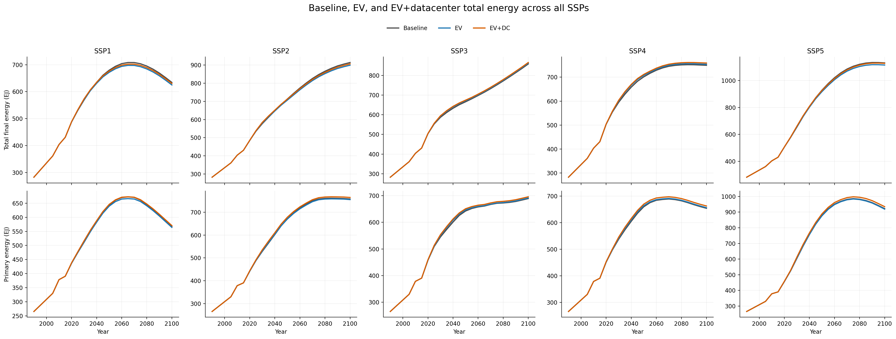
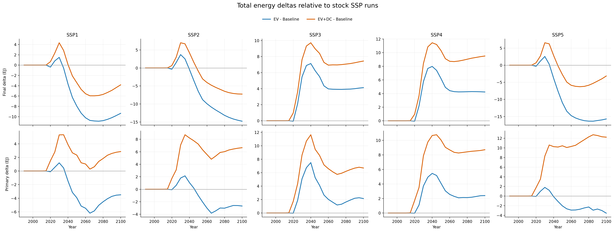
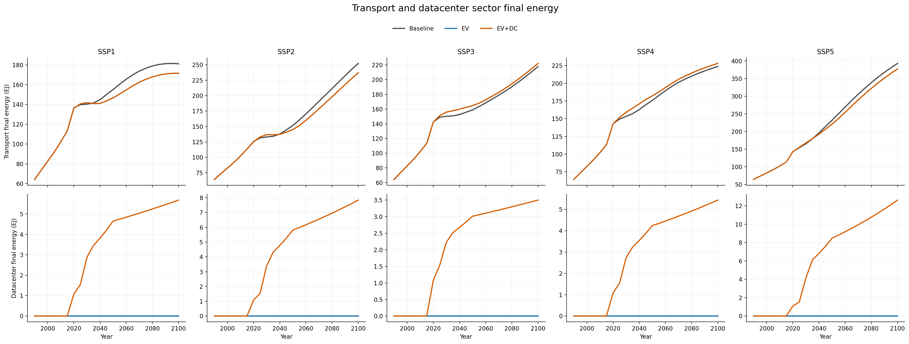
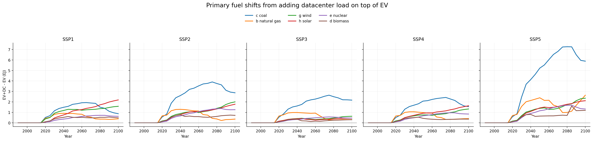

# GCAM EV and Data Center Sector Overlays

This repository is for `EV` and `data center sector` overlays for `GCAM v7.0` without modifying GCAM C++ source code. The implemented modules are:

- a transport electrification overlay so that `SSP1` to `SSP5` can represent a more explicit light-duty vehicle transition with separate `BEV`, `PHEV`, `FCEV`, `Hybrid Liquids`, `Liquids`, and `NG` pathways
- an explicit `comm datacenter sector` overlay implemented as an independent `energy-final-demand` sector with a matching electricity supplysector, so data-center electricity demand is added transparently while primary energy is still solved endogenously by GCAM

The design goal is to keep both modules consistent with GCAM's demand structure and energy accounting while making additional sector assumptions transparent and reproducible. The data center module is implemented as an incremental final-energy sector above stock demand rather than as a direct override to primary energy.

The repository is also structured so the two modules can be run separately or together. The evidence and design note for the data center module are in [docs/datacenter_sector_plan.md](docs/datacenter_sector_plan.md).

## What The Current Modules Change

- Adds `transportation_EV_SSP1.xml` to `transportation_EV_SSP5.xml` overlays for the GCAM `trn_pass_road_LDV_4W` sector.
- Keeps `BEV`, `FCEV`, `Hybrid Liquids`, `Liquids`, and `NG` as distinct transport technologies.
- Adds a new `PHEV` technology as a true dual-fuel GCAM technology with:
  - `elect_td_trn`
  - `refined liquids enduse`
- Applies SSP-specific schedules for:
  - transport technology share-weights
  - non-energy cost multipliers
  - energy-intensity coefficients
  - `PHEV` electric utility factor
- Generates:
  - `generated/exe/batch_SSP_EV.xml`
  - `generated/exe/configuration_ssp_ev.xml`
  - `generated/exe/run-gcam-ssp-ev.command`
  - `generated/output/queries/EV_SSP_queries.xml`
- Adds `datacenter_sector_SSP1.xml` to `datacenter_sector_SSP5.xml` overlays for a new regional `energy-final-demand` sector named `comm datacenter sector`.
- Couples that final-demand sector to an electricity-only `supplysector` and `global-technology-database` entry, both named `comm datacenter sector`.
- Keeps the data center module electricity-only through `elect_td_bld`.
- Treats the explicit data center sector as incremental load above a near-zero historical floor, so the overlay does not back-cast the full historical digital load into GCAM's calibration years.
- Generates:
  - `generated/exe/batch_SSP_DC.xml`
  - `generated/exe/configuration_ssp_dc.xml`
  - `generated/exe/run-gcam-ssp-dc.command`
  - `generated/exe/batch_SSP_EV_DC.xml`
  - `generated/exe/configuration_ssp_ev_dc.xml`
  - `generated/exe/run-gcam-ssp-ev-dc.command`
  - `generated/output/queries/DC_SSP_queries.xml`

## Modeling Logic

### 1. GCAM-consistent transport implementation

This add-on follows GCAM's native transport technology structure. It does not create a new top-level electricity demand sector. Instead, EVs remain transport technologies inside the existing LDV subsectors, which means:

- final energy remains transport final energy by carrier and technology
- primary energy remains an emergent system outcome from electricity, refining, hydrogen, and upstream supply modules

That is the correct GCAM accounting logic. In practice:

- `BEV` final energy is observed in transport queries through `elect_td_trn`
- `PHEV` final energy is split across `elect_td_trn` and `refined liquids enduse`
- primary energy impacts are read from GCAM's existing primary energy queries, not hand-coded into transport XML

### 2. GCAM-consistent data center implementation

The data center module no longer uses a commercial-building service overlay. It is implemented as a dedicated regional `energy-final-demand` sector named `comm datacenter sector`, paired with a same-named electricity `supplysector` and a matching `global-technology-database` entry.

The explicit data center load is handled as an incremental overlay:

- historical calibration periods remain essentially zero, with only a tiny `2015` seed to preserve a solvable path
- future demand is driven through `income-elasticity` schedules that are back-calculated from SSP GDP paths and the target electricity-demand trajectories
- all explicit demand enters as `elect_td_bld`, so the sector remains electricity-only while upstream primary energy is still endogenously determined by GCAM

This means:

- final energy from the new module appears directly in `total final energy by sector` under `comm datacenter sector`
- economy-wide final energy still appears in `total final energy by aggregate sector`
- primary energy response still appears in `primary energy consumption by region (direct equivalent)`

### 3. SSP mapping logic

The numeric schedules in this repository are not copied mechanically from IEA market shares. IEA publishes sales, stock, and scenario evidence, while GCAM uses logit-style share-weights and technology coefficients. The translation therefore follows a documented heuristic:

- preserve the ordering of technology adoption seen in authoritative scenario work
- translate that ordering into GCAM share-weights rather than raw sales shares
- apply faster cost and efficiency learning in high-innovation scenarios
- keep `PHEV` as a transition technology that grows early and declines later as `BEV` dominates

Current interpretation:

- `SSP1`: fastest EV transition; calibrated as an `IEA NZE`-like upper bound
- `SSP2`: central case; calibrated as an `IEA STEPS`-like pathway
- `SSP3`: delayed electrification below `STEPS`, informed by the weak-policy direction of `Current Policies`
- `SSP4`: currently uses the same transport overlay as `SSP3` because this repository does not yet distinguish within-region inequality effects in LDV adoption
- `SSP5`: high-income, high-mobility, high-innovation case with faster EV progress than `SSP2`, but not treated as a climate-constrained `NZE` path

This means the scenarios should be read as SSP-consistent EV overlays informed by IEA pathways, not as literal reproductions of IEA scenario outputs.

The rest of the SSP structure is intentionally left on the official GCAM pathway. `batch_SSP_EV.xml` is generated from the stock `batch_SSP_REF.xml`, and the only added SSP-specific input is the EV transport overlay:

- `SSP1`: `transportation_EV_SSP1.xml`
- `SSP2`: `transportation_EV_SSP2.xml`
- `SSP3`: `transportation_EV_SSP3.xml`
- `SSP4`: `transportation_EV_SSP4.xml`
- `SSP5`: `transportation_EV_SSP5.xml`

All other scenario-specific inputs continue to come from GCAM's official SSP batch file, including socioeconomic assumptions, buildings, AGLU, resource extraction, and non-CO2 controls.

For data centers, the mapping logic is different because the evidence is electricity demand rather than technology shares:

- `SSP1`: `IEA High Efficiency`-like path
- `SSP2`: `IEA Base Case`-like path
- `SSP3`: `IEA Headwinds`-like path
- `SSP4`: between `Base Case` and `Headwinds`, with stronger concentration in advanced regions
- `SSP5`: `IEA Lift-Off`-like path

Beyond `2035`, where IEA's scenario detail becomes thinner, the trajectories are explicit model extensions using damped annual growth rates that preserve SSP ordering. Those extensions are documented in [data/datacenter_ssp_assumptions.json](data/datacenter_ssp_assumptions.json).

### 4. PHEV logic

`PHEV` is implemented as a genuine two-input GCAM technology. Its calibration blends:

- non-energy costs from `BEV` and `Hybrid Liquids`
- electric energy use from `BEV`
- liquid fuel use from `Hybrid Liquids`

The `utility_factor` controls how much of the `PHEV` service demand is served by electricity versus liquids. Faster-electrifying SSPs use higher utility factors.

### 5. Final and primary energy accounting

To inspect energy accounting after a run, use the included query subset:

- `transport final energy by tech and fuel`
- `transport service output by tech`
- `LDV energy by primary fuel`
- `building final energy by service and fuel`
- `building service output by service`
- `total final energy by aggregate sector`
- `primary energy consumption by region (direct equivalent)`
- `primary energy consumption by region (avg fossil efficiency)`

This combination is intentional:

- the first three queries show the transport-side EV technology transition and carrier split
- the latter two queries show whether electrification is flowing through to economy-wide final and primary energy accounting

## Source Basis

### Primary institutional sources

- `IEA (2025), Global EV Outlook 2025`
  - used for the direction of global EV adoption, the continued dominance of BEVs over PHEVs, and the role of policy support and model availability
- `IEA (2025), World Energy Outlook 2025`
  - used for the policy interpretation of `STEPS` and `NZE`
- `IEA (2025), Energy and AI`
  - used for global data center electricity demand in `2024`, the `2030` Base Case anchor, the `2035` Base Case anchor, and the `Headwinds`, `High Efficiency`, and `Lift-Off` case ordering
- `IEA (2025), Electricity 2025`
  - used for near-term electricity-system context around large-load growth and supply response
- `GCAM v7.0 documentation`
  - used for model execution, query structure, XML overlay behavior, transport accounting, and building-service accounting

### Supporting academic sources

- `Kyle and Kim (2011)`
  - used as the closest GCAM-specific precedent for linking light-duty vehicle technology pathways to global greenhouse gas emissions and primary energy demand
- `Mishra et al. (2013), Transportation Module of GCAM`
  - used for transport module structure and technology logic
- `Masanet et al. (2020), Recalibrating global data center energy-use estimates`
  - used to avoid naive extrapolation of global data center electricity demand in historical years
- `Shehabi et al. (2024), 2024 United States Data Center Energy Usage Report`
  - used for AI-era data center load-growth context and infrastructure interpretation
- `Zhang et al. (2023)`
  - used for technology and efficiency context around low-carbon data center operation
- `O'Neill et al. (2017)` and `Riahi et al. (2017)`
  - used for SSP narrative interpretation

## Installation

### Requirements

- a working `GCAM v7.0` package
- Python 3

### 1. Generate the overlay files

```bash
python3 scripts/generate_ev_addon.py --gcam-root /path/to/gcam-v7.0-Mac_arm64-Release-Package
python3 scripts/generate_datacenter_addon.py --gcam-root /path/to/gcam-v7.0-Mac_arm64-Release-Package
```

If `--gcam-root` is omitted, the script defaults to a sibling directory named `gcam-v7.0-Mac_arm64-Release-Package`.

### 2. Install the generated files into the GCAM package

```bash
python3 scripts/install_addon.py --gcam-root /path/to/gcam-v7.0-Mac_arm64-Release-Package
```

### 3. Run GCAM with the desired batch configuration

```bash
cd /path/to/gcam-v7.0-Mac_arm64-Release-Package/exe
./gcam -C configuration_ssp_ev.xml
```

or use the generated launcher:

```bash
cd /path/to/gcam-v7.0-Mac_arm64-Release-Package/exe
./run-gcam-ssp-ev.command
```

The EV run writes its XML database to:

```text
../output/database_basexdb_ev_ssp
```

The data center-only run is:

```bash
cd /path/to/gcam-v7.0-Mac_arm64-Release-Package/exe
./run-gcam-ssp-dc.command
```

and writes to:

```text
../output/database_basexdb_dc_ssp
```

The combined EV + data center run is:

```bash
cd /path/to/gcam-v7.0-Mac_arm64-Release-Package/exe
./run-gcam-ssp-ev-dc.command
```

and writes to:

```text
../output/database_basexdb_ev_dc_ssp
```

## Repository Layout

```text
data/ev_ssp_assumptions.json
data/datacenter_ssp_assumptions.json
scripts/generate_ev_addon.py
scripts/generate_datacenter_addon.py
scripts/install_addon.py
generated/exe/configuration_ssp_ev.xml
generated/exe/configuration_ssp_dc.xml
generated/exe/configuration_ssp_ev_dc.xml
generated/exe/batch_SSP_EV.xml
generated/exe/batch_SSP_DC.xml
generated/exe/batch_SSP_EV_DC.xml
generated/exe/run-gcam-ssp-ev.command
generated/exe/run-gcam-ssp-dc.command
generated/exe/run-gcam-ssp-ev-dc.command
generated/exe/run-validate-ssp-three-way.command
generated/input/gcamdata/xml/transportation_EV_SSP*.xml
generated/input/gcamdata/xml/datacenter_sector_SSP*.xml
generated/output/queries/EV_SSP_queries.xml
generated/output/queries/DC_SSP_queries.xml
generated/output/queries/EV_DC_SSP_validation_queries.xml
scripts/check_batch_alignment.py
scripts/compare_ssp_three_way_validation.py
scripts/plot_validation_results.py
scripts/plot_datacenter_validation_results.py
scripts/plot_three_way_validation_results.py
docs/figures/*.png
docs/datacenter_sector_plan.md
```

## Validation

This add-on now includes an `ahe_generator_gcam`-aligned validation path for the energy outputs that matter for downstream AHE work. The core comparison is a three-way run set:

- stock `SSP1` to `SSP5`
- `SSP1` to `SSP5` + `EV`
- `SSP1` to `SSP5` + `EV + datacenter sector`

The validation uses the same two query titles that are used in [`TokyoTechGUC/ahe_generator_gcam`](https://github.com/TokyoTechGUC/ahe_generator_gcam):

- `primary energy consumption by region (direct equivalent)`
- `total final energy by aggregate sector`

- `queries[2]` in `input/reference_files/all_query.xml`
- `queries[58]` in `input/reference_files/all_query.xml`

For the explicit data center sector, the validation also includes:

- `total final energy by sector`

The three-way validation workflow is:

```bash
cd /path/to/gcam-v7.0-Mac_arm64-Release-Package/exe
./run-gcam-ssp-baseline.command
./run-gcam-ssp-ev.command
./run-gcam-ssp-ev-dc.command
./run-validate-ssp-three-way.command
```

This writes:

- `output/three_way_validation/baseline_validation.csv`
- `output/three_way_validation/ev_validation.csv`
- `output/three_way_validation/ev_dc_validation.csv`
- `output/three_way_validation/three_way_detail.csv`
- `output/three_way_validation/three_way_summary.csv`
- `output/three_way_validation/plots/validation_report.json`

Interpretation:

- `three_way_detail.csv` keeps the original query dimensions
  - `sector` for `total final energy by aggregate sector`
  - `sector` for `total final energy by sector`
  - `fuel` for `primary energy consumption by region (direct equivalent)`
- `three_way_summary.csv` aggregates within each query, scenario, year, and unit
- a negative transport-sector delta in final energy is the expected efficiency signal from EV uptake
- a positive `comm datacenter sector` final-energy series in the `EV+DC` case is the expected explicit load signal from the new sector
- primary energy deltas show the system-level upstream effect after electricity, hydrogen, and liquid-fuel supply are rebalanced by GCAM

To reproduce the three-way validation figures from the generated CSV files:

```bash
python3 scripts/compare_ssp_three_way_validation.py \
  --baseline /path/to/gcam-v7.0-Mac_arm64-Release-Package/output/three_way_validation/baseline_validation.csv \
  --ev /path/to/gcam-v7.0-Mac_arm64-Release-Package/output/three_way_validation/ev_validation.csv \
  --ev-dc /path/to/gcam-v7.0-Mac_arm64-Release-Package/output/three_way_validation/ev_dc_validation.csv \
  --out /path/to/gcam-v7.0-Mac_arm64-Release-Package/output/three_way_validation/three_way_detail.csv \
  --summary /path/to/gcam-v7.0-Mac_arm64-Release-Package/output/three_way_validation/three_way_summary.csv

python3 scripts/plot_three_way_validation_results.py \
  --detail /path/to/gcam-v7.0-Mac_arm64-Release-Package/output/three_way_validation/three_way_detail.csv \
  --summary /path/to/gcam-v7.0-Mac_arm64-Release-Package/output/three_way_validation/three_way_summary.csv \
  --out-dir /path/to/gcam-v7.0-Mac_arm64-Release-Package/output/three_way_validation/plots
```

## Validation Status

- XML generation completed for `SSP1` to `SSP5`
- installation into a local `GCAM v7.0` package completed
- stock `SSP1` to `SSP5`, `EV`, and `EV + datacenter sector` batches all completed successfully through database output
- the three-way comparison was completed for `SSP1` to `SSP5` across every available model year from `1990` to `2100`
- `check_batch_alignment.py` confirmed that the only SSP-specific additions relative to the stock GCAM batch are the EV transport overlay and the datacenter-sector overlay
- `validation_report.json` confirmed full coverage for all requested scenarios, years, sectors, and primary fuels with no missing rows

The completed validation shows that:

- `PHEV` dual-fuel XML is accepted by `GCAM v7.0`
- the EV overlay produces visible and traceable changes in both final and primary energy accounting under the same SSP background assumptions
- the data center overlay appears as an explicit `comm datacenter sector` in final-energy results while propagating through to global primary energy totals
- the requested `ahe_generator_gcam` query pair is available for every `SSP` and model year in the comparison outputs

Representative results from the completed three-way comparison:

- `SSP1 2050`: transport final energy changes from `155.09 EJ` in baseline to `146.63 EJ` with `EV`, while `EV+DC` stays at `146.62 EJ`; the added data center load appears separately as `4.65 EJ`
- `SSP2 2050`: total final energy changes from `713.38 EJ` in baseline to `706.94 EJ` with `EV`, then rebounds to `712.54 EJ` with `EV+DC`; total primary energy changes from `670.85 EJ` to `669.87 EJ` to `678.09 EJ`
- `SSP5 2100`: the explicit data center sector reaches `12.63 EJ`, and total primary energy rises from `918.99 EJ` in the `EV` case to `934.78 EJ` in the `EV+DC` case

## Validation Figures

### Baseline, EV, and EV+datacenter total energy across all SSPs and years



### Total energy deltas relative to stock SSP runs



### Transport and datacenter final energy



### Primary fuel shifts from adding datacenter load on top of EV



## Future Extension

The next planned step is not to invent another demand module immediately, but to deepen the evidence base and validation around the implemented `data center sector`, including:

- stronger regional calibration beyond the current group-based allocation
- additional validation figures for `building final energy by service and fuel`
- full combined `EV + data center` comparison outputs for every `SSP`

The design and evidence note remains in [docs/datacenter_sector_plan.md](docs/datacenter_sector_plan.md).

To verify that the EV batch keeps all non-transport SSP inputs aligned with the stock GCAM SSP batch:

```bash
python3 scripts/check_batch_alignment.py --gcam-root /path/to/gcam-v7.0-Mac_arm64-Release-Package
```

## Limitations

- `SSP4` currently reuses the `SSP3` transport overlay; this is a pragmatic placeholder, not a claim that the two SSPs are identical.
- The EV schedules are calibrated heuristically from institutional scenarios and SSP narratives. They are defensible, but they are not an econometric re-estimation of market shares.
- The repository currently targets passenger light-duty road transport. It does not yet add separate EV detail for buses, trucks, two-wheelers, or non-road transport.

## References

- IEA. 2025. *Global EV Outlook 2025*. [https://www.iea.org/reports/global-ev-outlook-2025](https://www.iea.org/reports/global-ev-outlook-2025)
- IEA. 2025. *Executive summary*. [https://www.iea.org/reports/global-ev-outlook-2025/executive-summary](https://www.iea.org/reports/global-ev-outlook-2025/executive-summary)
- IEA. 2025. *Trends in the electric car industry*. [https://www.iea.org/reports/global-ev-outlook-2025/trends-in-the-electric-car-industry-3](https://www.iea.org/reports/global-ev-outlook-2025/trends-in-the-electric-car-industry-3)
- IEA. 2025. *Outlook for electric mobility*. [https://www.iea.org/reports/global-ev-outlook-2025/outlook-for-electric-mobility](https://www.iea.org/reports/global-ev-outlook-2025/outlook-for-electric-mobility)
- IEA. 2025. *Outlook for energy demand*. [https://www.iea.org/reports/global-ev-outlook-2025/outlook-for-energy-demand](https://www.iea.org/reports/global-ev-outlook-2025/outlook-for-energy-demand)
- IEA. 2025. *World Energy Outlook 2025*. [https://www.iea.org/reports/world-energy-outlook-2025](https://www.iea.org/reports/world-energy-outlook-2025)
- IEA. 2025. *Scenarios in the World Energy Outlook 2025*. [https://www.iea.org/commentaries/scenarios-in-the-world-energy-outlook-2025](https://www.iea.org/commentaries/scenarios-in-the-world-energy-outlook-2025)
- IEA. 2025. *Stated Policies Scenario*. [https://www.iea.org/reports/world-energy-outlook-2025/stated-policies-scenario](https://www.iea.org/reports/world-energy-outlook-2025/stated-policies-scenario)
- IEA. 2025. *Net Zero Emissions by 2050*. [https://www.iea.org/reports/world-energy-outlook-2025/net-zero-emissions-by-2050](https://www.iea.org/reports/world-energy-outlook-2025/net-zero-emissions-by-2050)
- IEA. 2025. *Current Policies Scenario*. [https://www.iea.org/reports/world-energy-outlook-2025/current-policies-scenario](https://www.iea.org/reports/world-energy-outlook-2025/current-policies-scenario)
- GCAM documentation v7.0. *How to Get Started Running GCAM*. [https://jgcri.github.io/gcam-doc/v7.0/how-to-run-gcam.html](https://jgcri.github.io/gcam-doc/v7.0/how-to-run-gcam.html)
- GCAM documentation v7.0. *Model Interface*. [https://jgcri.github.io/gcam-doc/v7.0/model-interface.html](https://jgcri.github.io/gcam-doc/v7.0/model-interface.html)
- GCAM documentation v7.0. *GCAM User Guide*. [https://jgcri.github.io/gcam-doc/v7.0/user-guide.html](https://jgcri.github.io/gcam-doc/v7.0/user-guide.html)
- Mishra, G. S., et al. 2013. *Transportation Module of Global Change Assessment Model (GCAM): Model Documentation Version 1.0*. [https://escholarship.org/uc/item/8nk2c96d](https://escholarship.org/uc/item/8nk2c96d)
- Kyle, P., and S. H. Kim. 2011. *Long-term implications of alternative light-duty vehicle technologies for global greenhouse gas emissions and primary energy demands*. [https://doi.org/10.1016/j.enpol.2011.03.016](https://doi.org/10.1016/j.enpol.2011.03.016)
- O'Neill, B. C., et al. 2017. *The roads ahead: Narratives for shared socioeconomic pathways describing world futures in the 21st century*. [https://link.springer.com/article/10.1007/s10584-016-1605-1](https://link.springer.com/article/10.1007/s10584-016-1605-1)
- Riahi, K., et al. 2017. *The shared socioeconomic pathways and their energy, land use, and greenhouse gas emissions implications: An overview*. [https://link.springer.com/article/10.1007/s10584-017-2005-2](https://link.springer.com/article/10.1007/s10584-017-2005-2)
